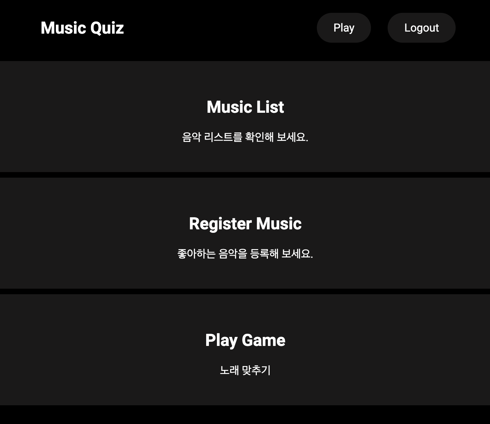
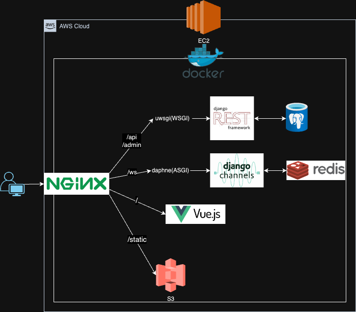
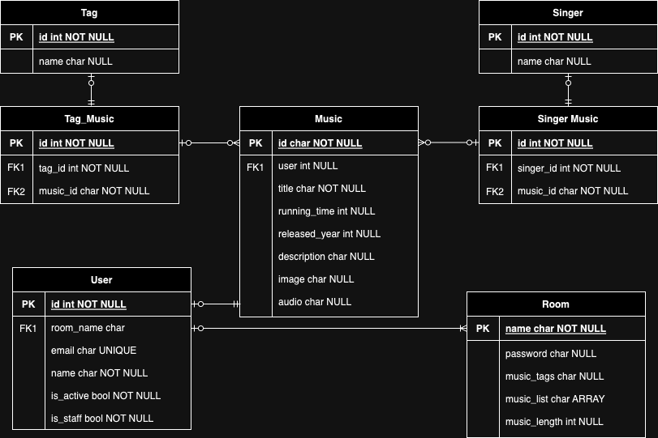
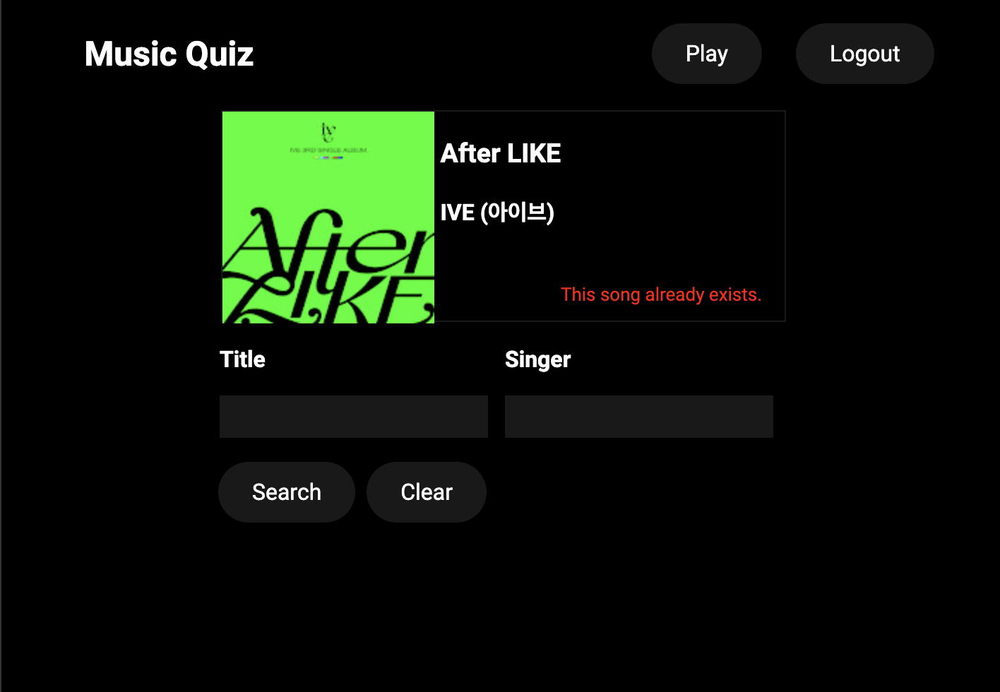
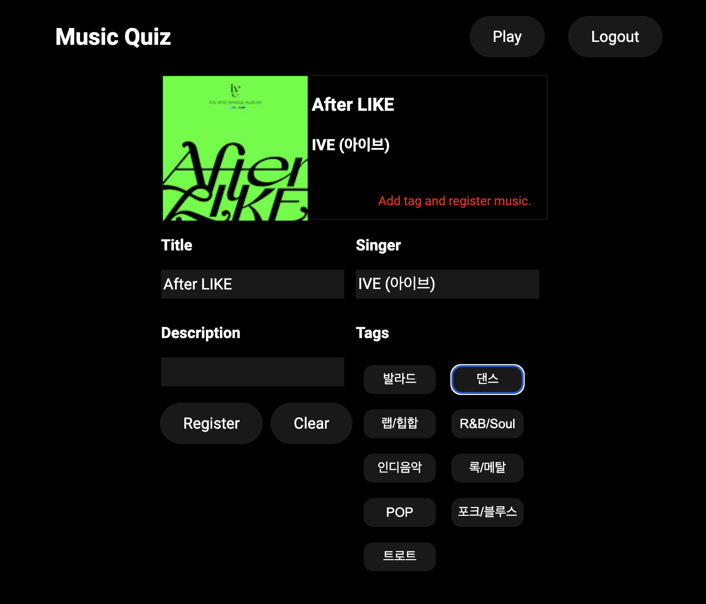
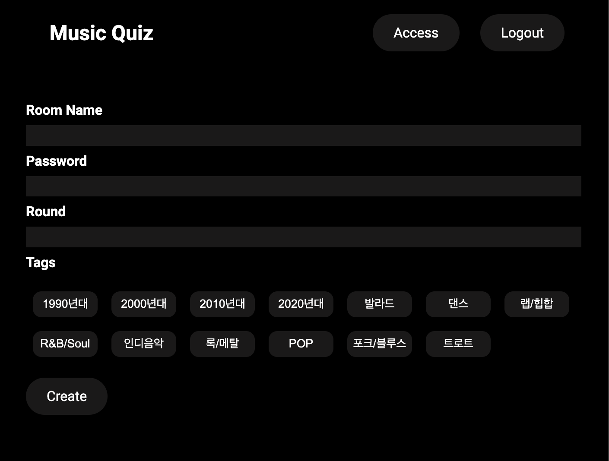
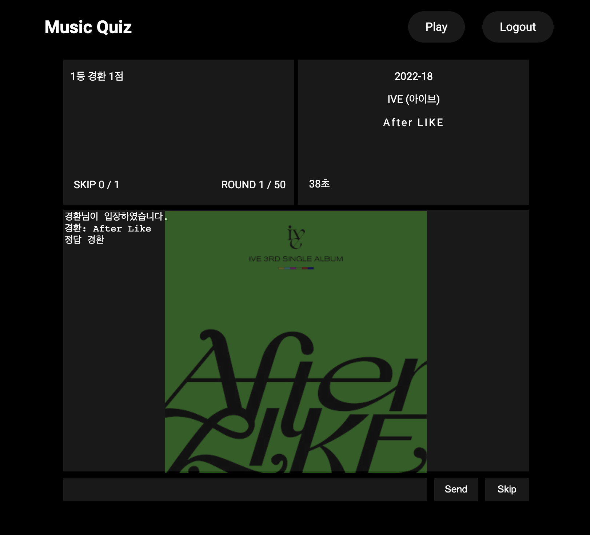

# 노래맞추기 웹 어플리케이션
<p align="center">
  <br>
  
  <br>
</p>

 - 현재 재생되는 노래의 제목을 가장 먼저 맞추는 사람이 점수를 가져가는 게임
 - 사용된 기술
    - Backend : Django, DRF(Django Rest Framework)
    - Frontend: Vue.js
    - Websocket: django channels
    - DB: Postgresql, redis
    - proxy: nginx
    - Cloud: AWS
    - Container: Docker

## 프로젝트 구조

<p align="center">
  <br>
  
  <br>
</p>

## ERD

</p>
<p align="center">
  <br>
  
  <br>
</p>

## 기능 소개

### 1. 원하는 노래 등록
<p align="center">
  <br>
  
  <br>
</p>
<p align="center">
  <br>
  
  <br>
</p>

- 등록하기를 원하는 노래 제목을 입력하게 되면 Youtubemusic 상단의 검색 결과중 단어의 유사도가 가장 높은 것을 알려줍니다.
- 검색 결과의 thumbnail을 클릭하면 해당 노래의 유튜브 링크로 연결됩니다.
- 만약 노래가 이미 존재하면 이를 알려줍니다.

<br>

### 2. 원하는 장르로 방 생성 
<p align="center">
  <br>
  
  <br>
</p>

- 원하는 장르로 방을 생성할 수 있습니다. 단, 아무것도 선택하지 않으면 등록된 모든 곡중 랜덤으로 생성됩니다.
- 라운드(노래의 수)는 1~100의 범위를 가지며 설정하지 않으면 기본 50곡으로 방이 생성됩니다.

<br>

### 3. 노래맞추기 게임 플레이
<p align="center">
  <br>
  
  <br>
</p>

- 게임이 시작되기 위해서는 모든 참가자가 skip을 눌러야합니다.
- skip의 단축키는 윗 방향키입니다.
- 한번 게임이 시작되면 과반이상의 참가자가 skip을 누르면 다음곡으로 넘어갑니다.
- 해당 라운드에 정답자가 발생하지 않았지만 skip이 되는 경우 곡의 제목이 노출되면 10초후에 자동으로 스킵됩니다.
- 해당 라운드에 정답자가 발생하면 모든 곡의 정보가 노출됩니다.(곡의 thumbnail, 제목, 가수 등등)
- 곡의 재생시간에 따라 힌트가 노출됩니다.
  - 10초: 곡의 출시년도
  - 20초: 가수 이름
  - 30초: 제목의 글자수
  - 40~80초: 제목의 초성을 글자수에 비례해 일정한 간격으로(단, 특수문자의 경우 *, 영어의 경우 a)
  - 90초: 정답자가 발생하지않으면 자동으로 곡의 정보가 노출되며 10초후에 스킵됩니다.

<br>

## 실행방법

### 1. 레포지토리 클론
```
git clone https://github.com/skh1225/music-quiz-app.git
```

### 2. music-quiz-vue 환경변수 설정
- `music-quiz-vue/.env` 의 주소를 변경
  - VUE_APP_API_URL = <URL>
  - 배포 환경이라면 public dns, 로컬환경이라면 localhost:8000
 
### 3. dist 폴더 생성
```
cd music-quiz-vue
npm install
npm run build
```
- music-quiz-vue에 생성된 dist 디렉토리를 `music-quiz-api/proxy` 에 복사

### 4. music-quiz-api 변수 설정
- music-quiz-api 폴더의 .env 파일의 `DJANGO_ALLOWED_HOSTS`의 값을 `VUE_APP_API_URL`와 동일한 값으로 변경
- `DJANGO_SECRET_KEY` 값을 아무 값으로 변경 ex) adslkfjak23sjd4flk23ajs1dkfajdkflj
- google api를 사용하기위해 oauth.json 생성하고 music-quiz-api/app 에 저장 (<a href='https://ytmusicapi.readthedocs.io/en/stable/setup/oauth.html'>참고</a>) 

### 5. docker compose
```
docker-compose up ## 로컬환경
docker-compose -f docker-compose-deploy.yml up ## 배포 환경
```

## 라이센스

MIT &copy; [NoHack](mailto:lbjp114@gmail.com)

<!-- Stack Icon Refernces -->

